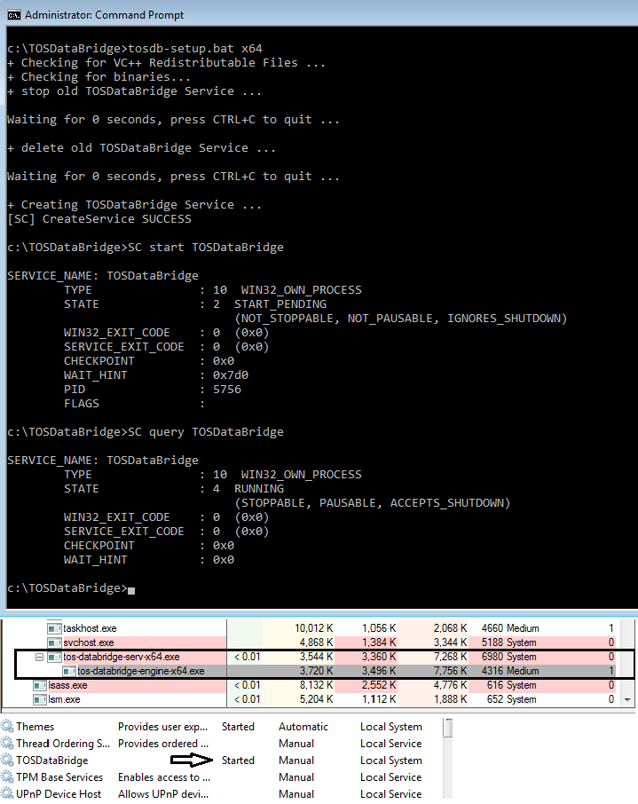

### Installation Details
- - -

1. Move the unzipped tos-databridge folder to its permanent location. If you change it in the future you'll need to redo some of these steps because the Service module relies on an absolute path.

2. Determine the appropriate build you'll need: 32-bit(x86) or 64-bit(x64). ***Make sure you don't mix and match in future steps. It should match the python or Java Runtime(JRE) version if you plan on using the python or java wrappers, respectively.***
 
3. (***Optional***) Compile the appropriate binaries if [building from source](README.md#build-optional).  
   
4. Determine if your TOS platform runs under elevated privileges (does it ask for an admin password before starting?)
   
5. Determine if you need to run under a custom Session. The tos-databridge-engine-[build].exe binary needs to run in the same session as the ThinkOrSwim platform. **MOST USERS SHOULDN'T WORRY ABOUT THIS** unless they plan to run in a non-standard environment (e.g an EC2 instance). 
  
6. Open a command shell with Admin Privileges (right-click on cmd.exe and click 'run as administrator'). Navigate to the tos-databridge root directory and run the tosdb-setup.bat setup script with the info from steps #2, #4, and #5:
    
    ```
    Usage: C:\TOSDataBridge\> tosdb-setup.bat   [x86|x64]   [admin]   [session]
     
    Example 1: C:\TOSDataBridge\> tosdb-setup.bat x86
    Example 2: C:\TOSDataBridge\> tosdb-setup.bat x64 admin
    Example 3: C:\TOSDataBridge\> tosdb-setup.bat x64 admin 2
    ```

7. The setup script is going to do a few things:     
    - make sure you have the appropriate run-time libraries installed; if not the appropriate redist executable will be run to install them. (If this fails you can do this manually by downloading the most recent VC++ Redistributable from Microsoft); 
    - make sure you have the appropriate -serv and -engine binaries in /bin
    - create the Windows Service.
 
8. Before we continue, it's a good idea, possibly necessary, to add the tos-databridge binaries, or the whole directory, to your anti-virus's 'white-list'. ***If not tos-databridge-engine-[build].exe may be stopped and/or deleted. If you run into problems connecting to the service/engine module or the TOS platform be sure to check the logs/settings.***
  
9.  After the Windows Service has been successfully created run: 

    ```(Admin) C:\> SC start TOSDataBridge```  

    Returned text and various system utilities should confirms the service is running(see screen-shot below). Let's also configure the service to begin automatically on system start-up:
    
    ```(Admin) C:\> SC config TOSDataBridge start= auto``` (notice the space between '=' and 'auto')
    
    [More information about the service.](README_SERVICE.md)

    (note: some of the particulars in these (older) screen-shots may be different for newer versions)    
    

10. (***C/C++ ONLY***) Include the tos_databridge.h header in your code. If C++ make sure the compiler can find containers.hpp, generic.hpp, and exceptions.hpp. Adjust the link settings to import the tos-databridge-[version]-[build].lib stub. (If you run into trouble review the VisualStudio settings for tos-databridge-shell-[build].exe as they should resemble what you're trying to do.)
   
11. (***C/C++ ONLY***) Add appropriate [C/C++ API calls](README_API.md) to your code. Build.

12. (***JAVA ONLY***) Add java/tosdatabridge.jar to your classpath.

13. (***JAVA ONLY***) Add appropriate [Java API calls](README_JAVA.md) to you code. Build.

14. (***PTHON ONLY***) [Install the tosdb package.](README_PYTHON.md#install)

15. Start the TOS platform.

16. Run your program or use the [python wrapper](README_PYTHON.md) interactively.

